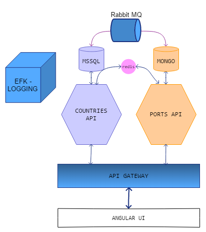

# Microk8s-Sample Single Node Cluster POC Deployment


Simple distributed applications running across multiple Docker containers.

Getting started
---------------

Download [Docker Desktop](https://www.docker.com/products/docker-desktop) for Mac or Windows. [Docker Compose](https://docs.docker.com/compose) will be automatically installed. On Linux, make sure you have the latest version of [Compose](https://docs.docker.com/compose/install/). 

Run the app in Kubernetes
-------------------------

Each folder contains the yaml specifications for the distributed applications.

First create the bdn-poc namespace

```
$ kubectl create namespace bdn-poc
```

Run the following command to create the deployments and services objects:
```
$ kubectl create -f name-of-the-file-name-under-each-folder.yaml
```

The UI interface to show list of countries and ports is then available on host of the cluster.

Architecture
-----



* A front-end web app in [Angular](/MicroK8s-UI) which lets you retrieve two end-points data i,e Countries and Ports
* A [Redis](https://hub.docker.com/_/redis/) or [NATS](https://hub.docker.com/_/nats/) queue which collects/reads countries/ports


Note
----
